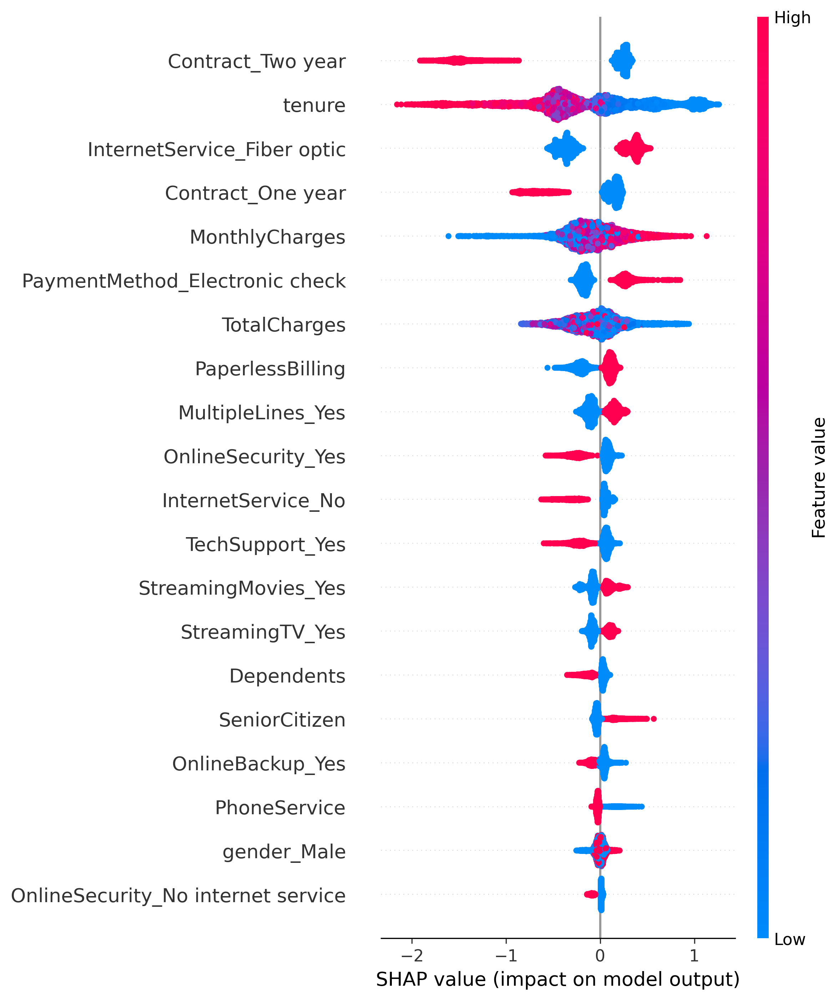
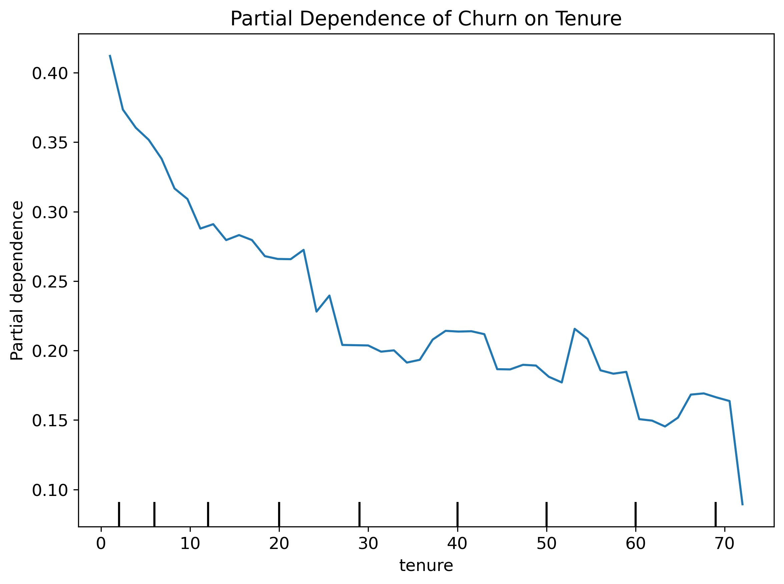
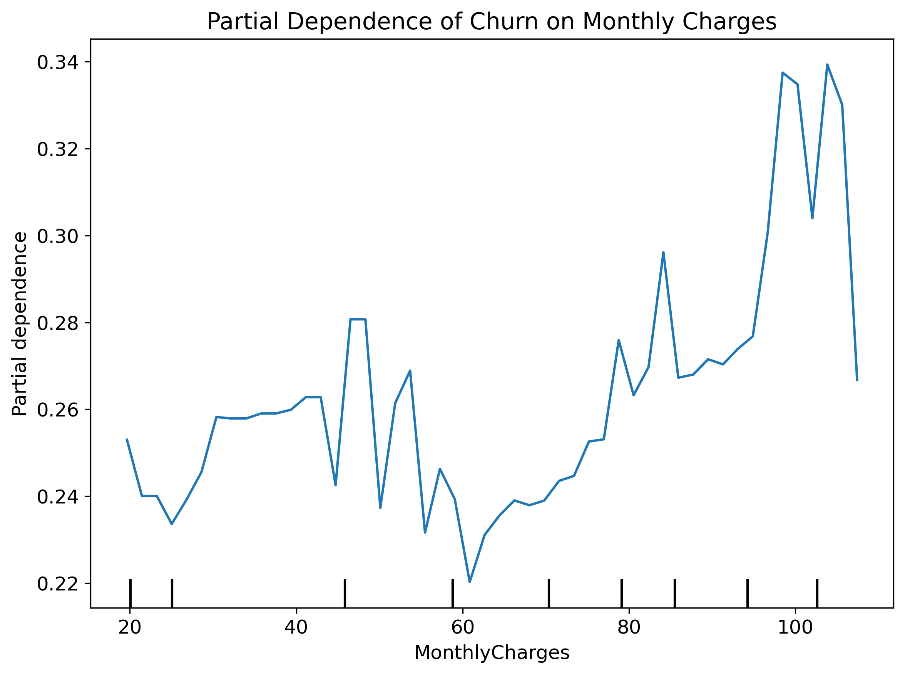
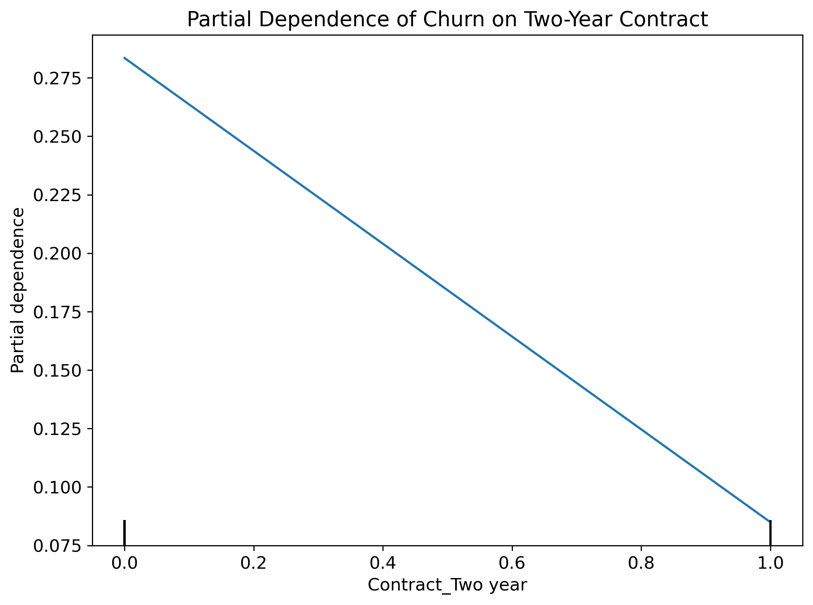
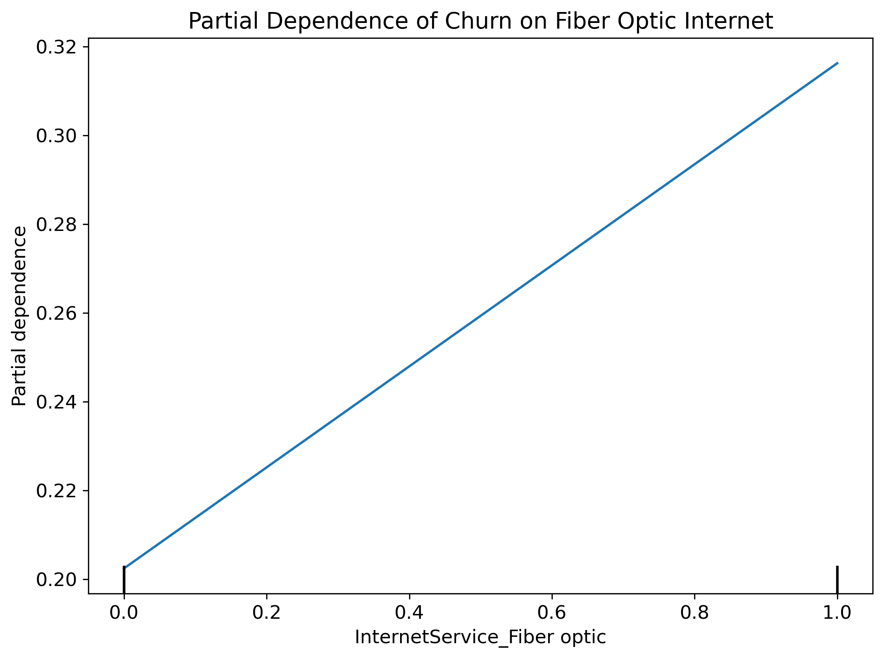
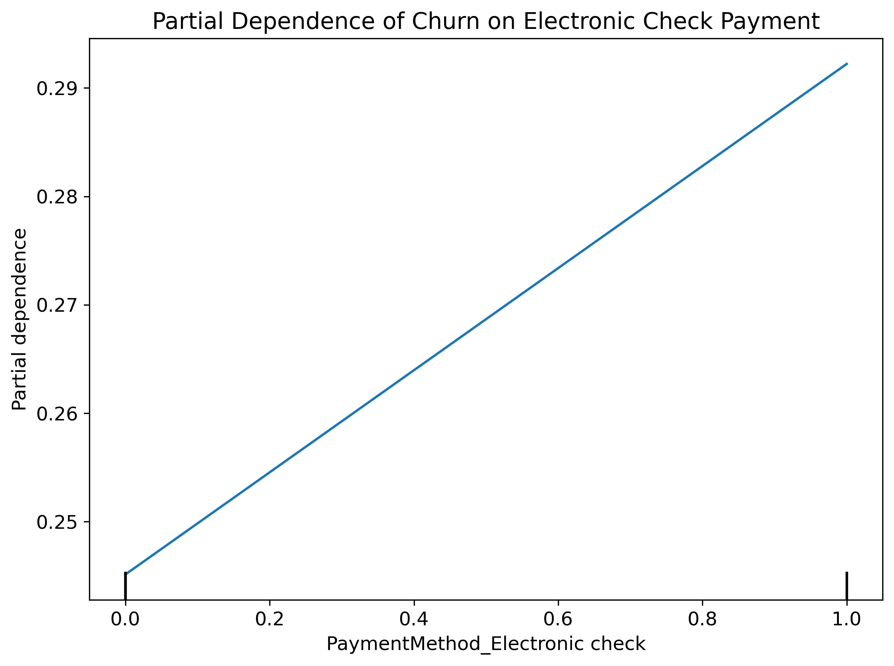

# Customer Churn Prediction & Decision Dashboard

## Overview

This project implements an end-to-end machine learning system for predicting customer churn and converting model predictions into actionable business decisions.

Rather than stopping at churn probability estimation, the system answers a practical question:

**Should a company intervene for a specific customer, and is that intervention economically justified?**

The project combines predictive modeling, explainability, and cost–benefit analysis into a single interactive dashboard.

---

## Problem Statement

Customer churn has a direct impact on revenue. While churn prediction models estimate the probability of churn, real-world business decisions require more than probabilities.

This project bridges the gap between:

- Machine learning predictions
- Business actions (contact vs no contact)
- Financial outcomes (profit or loss)

---

## Key Features

- Binary churn prediction using supervised learning
- Comparison of Logistic Regression and XGBoost models
- Probability-based decision thresholds
- Cost–benefit analysis for retention actions
- Per-customer model explainability
- Interactive Streamlit web application

---

## Dataset Description

### Source

The dataset used in this project is the **Telecom Customer Churn Dataset**, originally published on **Kaggle**.
Link: https://www.kaggle.com/datasets/blastchar/telco-customer-churn?resource=download

It represents customer-level data from a telecommunications company and is widely used for churn prediction research and applied machine learning projects.

---

### Dataset Overview

- **Rows:** ~7,000 customers
- **Target Variable:** `Churn` (binary)
- **Data Type:** Tabular, structured
- **Domain:** Telecommunications / Subscription services

Each row represents **one customer**, with features describing their subscription, services, and billing history.

---

### Target Variable

| Column  | Description                                                  |
| ------- | ------------------------------------------------------------ |
| `Churn` | Indicates whether the customer churned (`Yes`) or not (`No`) |

For modeling purposes, the target was encoded as:

- `1` → Churned
- `0` → Retained

---

### Feature Groups

The dataset contains several logical groups of features:

---

#### 1. Customer Demographics

| Feature         | Description                              |
| --------------- | ---------------------------------------- |
| `gender`        | Customer gender                          |
| `SeniorCitizen` | Whether the customer is a senior citizen |
| `Partner`       | Whether the customer has a partner       |
| `Dependents`    | Whether the customer has dependents      |

These features describe **who the customer is**, not how they use the service.

---

#### 2. Account Information

| Feature            | Description                                               |
| ------------------ | --------------------------------------------------------- |
| `tenure`           | Number of months the customer has stayed with the company |
| `Contract`         | Contract type (Month-to-month, One year, Two year)        |
| `PaperlessBilling` | Whether the customer uses paperless billing               |
| `PaymentMethod`    | Payment method used by the customer                       |

These features capture **commitment level and billing preferences**, which are strongly correlated with churn.

---

#### 3. Service Usage

| Feature            | Description                             |
| ------------------ | --------------------------------------- |
| `PhoneService`     | Whether the customer has phone service  |
| `MultipleLines`    | Whether the customer has multiple lines |
| `InternetService`  | Type of internet service                |
| `OnlineSecurity`   | Online security add-on                  |
| `OnlineBackup`     | Online backup service                   |
| `DeviceProtection` | Device protection service               |
| `TechSupport`      | Technical support service               |
| `StreamingTV`      | Streaming TV service                    |
| `StreamingMovies`  | Streaming movies service                |

These features represent **product adoption and service depth**.

---

#### 4. Billing & Charges

| Feature          | Description                                     |
| ---------------- | ----------------------------------------------- |
| `MonthlyCharges` | Monthly amount charged                          |
| `TotalCharges`   | Total amount charged over the customer lifetime |

These numeric features are critical for identifying **high-risk, high-value churners**.

---

### Data Cleaning & Preprocessing

The following preprocessing steps were applied before modeling:

1. **Target Encoding**
   - `Churn` converted to binary (0 / 1)

2. **Categorical Encoding**
   - Binary categorical features encoded as 0 / 1
   - Multi-class categorical features one-hot encoded

3. **Numeric Processing**
   - `TotalCharges` converted to numeric
   - Missing or invalid entries handled appropriately
   - Numerical features scaled where required (Logistic Regression)

4. **Feature Consistency**
   - Final feature set stored in `data/processed/features.csv`
   - Same feature ordering used for training and inference

---

### Why This Dataset Was Chosen

- Realistic business problem
- Balanced mix of demographic, behavioral, and financial features
- Suitable for both:
  - Interpretable models (Logistic Regression)
  - Non-linear models (XGBoost)
- Well-aligned with churn use cases in telecom, SaaS, and subscription businesses

---

## Data Preprocessing

Before model training, the raw dataset was systematically cleaned and transformed to ensure data quality, consistency, and compatibility with machine learning models.

All preprocessing steps were designed to be **deterministic and reproducible**, and the same transformations are used during inference in the deployed application.

---

### 1. Target Variable Encoding

The target variable `Churn` was converted from a categorical label to a binary numeric format:

- `Yes` → `1` (Customer churned)
- `No` → `0` (Customer retained)

This encoding enables the use of standard binary classification algorithms and probability-based decision thresholds.

---

### 2. Handling of Missing and Invalid Values

- The `TotalCharges` column was converted from string to numeric format.
- Rows with invalid or missing `TotalCharges` values (resulting from customers with very short tenure) were handled appropriately to avoid training bias.
- After preprocessing, the final dataset contains **no missing values**.

---

### 3. Feature Type Identification

Features were divided into two main categories:

#### Numerical Features

- `tenure`
- `MonthlyCharges`
- `TotalCharges`

These features represent continuous quantities and were treated differently depending on the model.

#### Categorical Features

All remaining features (e.g. service types, contract type, payment method) were treated as categorical variables.

---

### 4. Encoding of Categorical Features

- Binary categorical variables (e.g. `Yes` / `No`) were encoded as:
  - `Yes` → `1`
  - `No` → `0`

- Multi-class categorical variables (e.g. `Contract`, `InternetService`, `PaymentMethod`) were transformed using **one-hot encoding**.

This ensures that:

- No ordinal relationship is incorrectly imposed
- Models can learn independent effects of each category

---

### 5. Feature Scaling

Feature scaling was applied **only where necessary**:

- **Logistic Regression**
  - Numerical features were standardized using `StandardScaler`
  - This ensures stable convergence and interpretable coefficients

- **XGBoost**
  - No scaling was applied
  - Tree-based models are invariant to feature scale

This model-specific preprocessing avoids unnecessary transformations and preserves interpretability.

---

### 6. Train–Test Split

The dataset was split into training and test sets using:

- **80% training**
- **20% testing**
- **Stratified sampling** on the `Churn` target

Stratification ensures that the churn distribution is preserved in both sets.

---

## Threshold Analysis and Cost Optimization - Models

Rather than using a fixed classification threshold (such as 0.5), this project explicitly analyzes how **different decision thresholds** affect:

- Precision and recall
- Number of customers contacted
- Number of churners saved
- Overall business profit

This allows separating **model performance** from **business decision-making**.

### Global Feature Importance (SHAP)

The following SHAP summary plot shows the most influential features driving churn predictions across the dataset.

Features such as contract type, tenure, and internet service consistently dominate churn risk across customers.

### Partial Dependence Analysis

The partial dependence plot below illustrates how churn probability changes with customer tenure.

Customers with shorter tenure exhibit significantly higher churn probability, which decreases as tenure increases.

Higher monthly charges are associated with increased churn risk, particularly for customers without long-term contracts.

Two-year contracts strongly reduce churn probability, reflecting higher customer commitment.

Fiber optic customers show higher churn risk, potentially due to pricing sensitivity or service expectations.

Electronic check payment method is associated with higher churn probability compared to automated payment options.

---

### 1. Probability Thresholds

Both models output a **churn probability** between 0 and 1.

A threshold `t` is applied such that:

- If `P(churn) ≥ t` → customer is classified as high risk
- If `P(churn) < t` → customer is classified as low risk

Lower thresholds prioritize **recall** (catching more churners).  
Higher thresholds prioritize **precision** (fewer false positives).

---

### 2. Threshold vs Precision–Recall Trade-off

#### Logistic Regression

| Threshold | Precision | Recall |
| --------- | --------- | ------ |
| 0.20      | 0.386     | 0.961  |
| 0.30      | 0.427     | 0.929  |
| 0.40      | 0.472     | 0.870  |
| 0.50      | 0.519     | 0.801  |

**Interpretation:**

- Very high recall at low thresholds
- Precision improves as threshold increases
- Suitable when missing churners is very costly

---

#### XGBoost

| Threshold | Precision | Recall |
| --------- | --------- | ------ |
| 0.20      | 0.516     | 0.904  |
| 0.30      | 0.592     | 0.835  |
| 0.40      | 0.673     | 0.724  |
| 0.50      | 0.735     | 0.596  |

**Interpretation:**

- Better precision than Logistic Regression at all thresholds
- More balanced precision–recall trade-off
- Better discrimination ability (higher ROC AUC)

---

### 3. Cost Model Assumptions

To translate predictions into business decisions, the following assumptions are used:

- **Cost to contact a customer** (marketing / call center)
- **Value of a retained customer**
- **Retention success rate** (probability that a contacted churner stays)

These parameters are configurable and **not hard-coded into the model**.

---

### 4. Profit Calculation Logic

For each threshold `t`, the expected profit is computed as:
Expected Profit = (Expected churners saved × Customer value) − (Number of customers contacted × Contact cost)

Where:

- Expected churners saved depends on recall and retention success rate
- Number of customers contacted depends on the threshold

---

### 5. Profit Optimization Results

#### Logistic Regression – Profit by Threshold

- Maximum profit achieved around **threshold ≈ 0.18**
- Profit peak: **≈ ₹3.14 million**
- Contacts a large number of customers (~4,700–5,000)
- Saves many churners, but with higher contact costs

This model favors **aggressive intervention**.

---

#### XGBoost – Profit by Threshold

- Maximum profit achieved around **threshold ≈ 0.09**
- Profit peak: **≈ ₹3.21 million**
- Contacts fewer customers than Logistic Regression
- Achieves similar churn savings with lower operational cost

This model is **more cost-efficient**.

---

### 6. Model Comparison (Business Perspective)

| Aspect              | Logistic Regression | XGBoost |
| ------------------- | ------------------- | ------- |
| Optimal threshold   | ~0.18               | ~0.09   |
| Max profit          | ~₹3.14M             | ~₹3.21M |
| Customers contacted | High                | Lower   |
| Cost efficiency     | Moderate            | High    |

---

### 7. Key Conclusions

- A fixed threshold of 0.5 is **suboptimal** for churn problems
- Optimal thresholds depend on **business costs**, not accuracy alone
- XGBoost delivers higher profit with fewer interventions
- Threshold tuning is as important as model selection

---

### 8. Why This Matters

This analysis demonstrates that:

- Machine learning predictions must be combined with business logic
- Model evaluation should go beyond accuracy
- Profit-aware decision thresholds lead to better real-world outcomes

This approach closely reflects how churn models are deployed in production systems.

## Streamlit Application and Decision System

To demonstrate how the churn prediction models can be used in a real-world setting, this project includes an **interactive Streamlit web application**.

The application connects model predictions, business rules, and explainability into a single decision-support interface.

---

### Purpose of the Application

The goal of the application is not only to predict churn, but to answer:

- Should the company take action for this customer?
- What is the expected financial outcome of that action?
- Why did the model make this prediction?

---

### Application Overview

The Streamlit dashboard allows the user to:

- Select a trained model (Logistic Regression or XGBoost)
- Choose an existing customer or manually input customer details
- Configure business parameters such as costs and retention success
- Adjust probability thresholds for decision-making
- View predictions, profit estimates, and explanations

All calculations are performed in real time.

---

### Input Modes

#### 1. Existing Customer Mode

- The user selects a customer by index from the dataset
- The exact same feature values used during training are passed to the model
- This mode is useful for testing and validation

#### 2. New Customer (Manual Input) Mode

- The user manually enters feature values
- Binary features are entered using Yes/No selections
- Numeric features are entered using number inputs
- The input is transformed into the same feature format used during training

This ensures full consistency between training and inference.

---

### Model Selection

The user can select between:

- **Logistic Regression**
  - Interpretable baseline
  - Coefficient-based explanations

- **XGBoost**
  - Higher predictive performance
  - SHAP-based explanations

Both models are loaded from serialized files using `joblib`, ensuring no dependency on training or experiment tracking during deployment.

---

### Decision Logic in the Application

The application separates prediction from decision-making:

1. The model predicts `P(churn)`
2. An **attention threshold** determines whether the customer should be evaluated further
3. A **decision threshold** determines whether to contact the customer
4. Expected profit or loss is calculated using user-defined costs

This design allows business policies to be changed without retraining the model.

---

### Business Impact Calculation

For customers above the attention threshold, the following quantities are computed:

- Expected value saved from retention
- Cost of contacting the customer
- Expected profit from intervention
- Expected loss if no action is taken

These values are shown transparently to support decision-making.

---

### Model Explainability

To ensure transparency, the application includes model-specific explanations:

#### XGBoost

- SHAP values explain how each feature contributes to the churn probability
- Positive values increase churn risk
- Negative values reduce churn risk

#### Logistic Regression

- Model coefficients show the direction and strength of feature influence
- Positive coefficients increase churn probability
- Negative coefficients reduce churn probability

This makes the predictions interpretable for both technical and non-technical users.

---

### Design Principles

The application was designed with the following principles:

- Consistency between training and inference
- Clear separation of model logic and business logic
- Transparency of decisions and assumptions
- Configurability without retraining models

---

### Deployment

## MLOps Practices Used in This Project

This project applies **lightweight but practical MLOps principles** appropriate for a personal end-to-end machine learning project.

The focus is on **reproducibility, experiment tracking, model versioning, and deployment readiness**, rather than large-scale production infrastructure.

---

### Experiment Tracking (MLflow)

MLflow was used during the experimentation phase to:

- Track multiple model runs
- Log metrics such as Accuracy, Precision, Recall, ROC-AUC
- Compare Logistic Regression and XGBoost models
- Store trained model artifacts
- Perform threshold and cost-based analysis consistently

This allowed systematic comparison of models and thresholds instead of ad-hoc experimentation.

---

### Model Versioning and Reproducibility

- Each trained model was logged as an artifact
- Final selected models were exported and serialized using `joblib`
- The deployed application uses **fixed, versioned model files**
- No training occurs at inference time

This ensures reproducibility and prevents accidental model drift.

---

### Deployment-Oriented Design

The project follows deployment-oriented practices:

- Training, analysis, and application code are clearly separated
- Models are loaded independently of training scripts
- The Streamlit app does not depend on MLflow at runtime
- All parameters affecting decisions are configurable at inference time

This mirrors real-world MLOps separation between experimentation and serving.

---

### Summary of MLOps Usage

| Area                  | Used         |
| --------------------- | ------------ |
| Experiment tracking   | Yes (MLflow) |
| Model versioning      | Yes          |
| Reproducibility       | Yes          |
| Deployment separation | Yes          |
| CI/CD automation      | No           |
| Monitoring            | No           |

The applied MLOps practices are **appropriate for the project scope**.

---

## Project Structure

The repository is organized to clearly separate concerns and support maintainability.

customer_churn/
│
├── data/
│ ├── raw/ # Original Kaggle dataset
│ └── processed/ # Cleaned and feature-engineered data
│
├── models/
│ ├── xgboost.pkl # Final XGBoost model
│ └── logreg.pkl # Final Logistic Regression model
│
├── src/
│ ├── data/ # Data loading and preprocessing
│ ├── models/ # Model training scripts
│ ├── analysis/ # Threshold, cost, SHAP, PDP analysis
| ├── features/ # build feature columns
│
├── app/
│ └── streamlit_app.py # Streamlit dashboard
│
├── reports/
│ ├── plots/ # ROC, threshold, profit plots, SHAP and PDP outputs
│
├── requirements.txt
├── README.md
└── .gitignore

---

## Future Improvements

Several extensions could further improve the system:

- Time-based validation and retraining strategy
- Customer lifetime value (CLV) modeling
- Segment-specific retention success rates
- Automated threshold optimization inside the application
- Integration with CRM or marketing tools
- Cloud deployment with monitoring and logging
- Fairness and bias analysis

These would be natural next steps in a production environment.

---

## Conclusion

This project demonstrates a complete end-to-end churn prediction system:

- Real-world dataset
- Careful preprocessing
- Multiple models with quantitative comparison
- Business-aware threshold and cost optimization
- Explainable predictions
- Interactive decision-support application

The project bridges the gap between **machine learning models and business decisions**, reflecting how churn prediction systems are used in practice.
